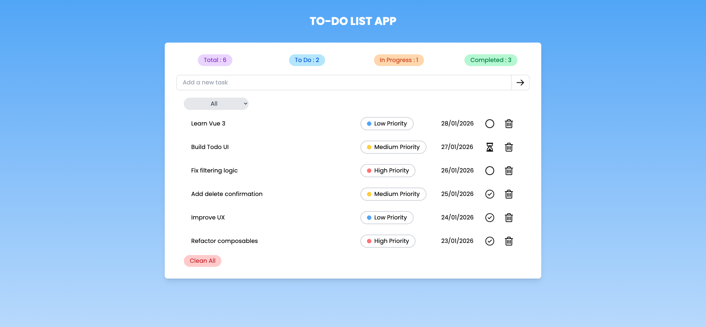
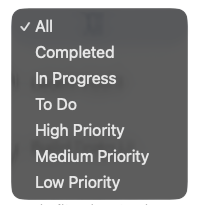
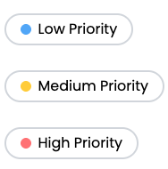
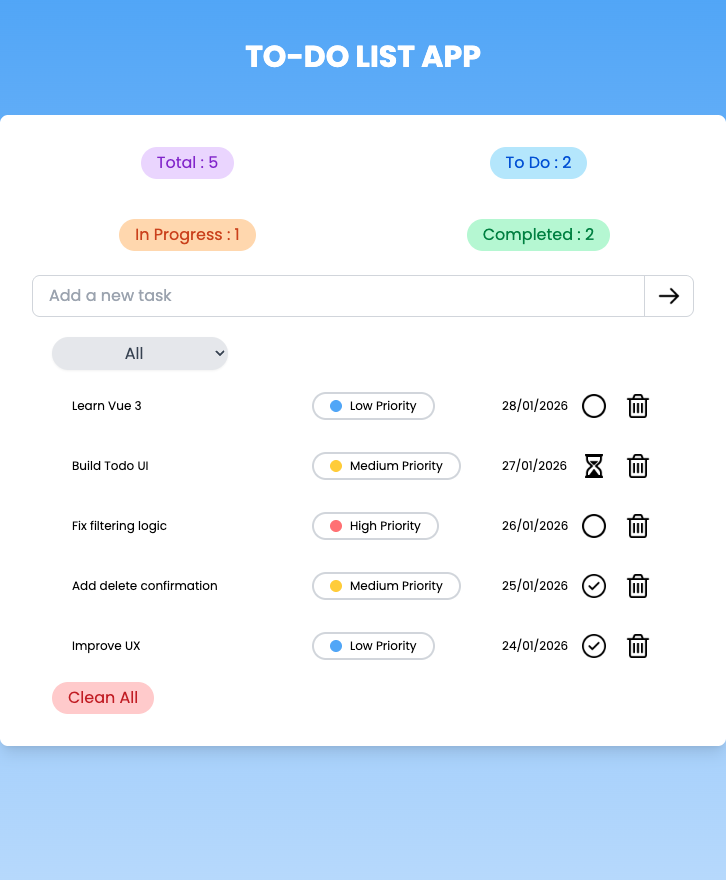

# To-Do List App de Aurélien.K

 - This repository contains a To-Do List project developed with Vue.js. The app has many features:
 - Create custom tasks with different states: To-Do, In Progress, Completed
 - Display statistics of the number of tasks remaining
 - Change the priority level of each task
 - Apply filters to the list of tasks
 - Responsive design for different devices (tablet and computer)

# 📸 Screenshots of the project

## 🏠 Home :

Here is a screenshot of the home page


 
 
## 📝 Create a Task :

The input allows you to choose the title of the task. You can create a task by pressing the Enter key or by clicking the button on the right of the input.


## 📊 Tasks Counter :

The counters update automatically whenever a task is created or modified. There is a specific counter for each status.


## 🔍 Filter :

The filter allows you to select tasks by their state or priority.





## 🚩 Priority :

You can customize the priority of each task. There are three levels of priority: Low, Medium, High.




## 📱 Responsive Design :

The application is fully responsive. There are two different layouts: one for computers and one for tablets. The organization of elements for tablets is adjusted to improve the user experience (UX).




# 🛠️ Languages Used

- JavaScript
- Vue.js
- Tailwind CSS


# ⚙️ Installation

Clone the repository:
```bash
git clone https://github.com/arlmoop/To-Do-List-App
```

Navigate into the project folder:
```bash
cd To-Do-List-App
```

Install dependencies:
```bash
npm install
```

Run the development server:
```bash
npm run dev
```

To see the app, copy and paste this URL in your browser: http://localhost:5173/
Or press "o" and then Enter in the terminal while the local server is running.

# 🚀 Future Improvements :

 - Backup to save the tasks
 - Option to sort tasks by priority/status/date

-- Aurelien's Project --
